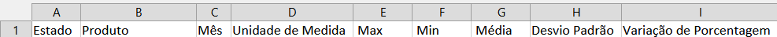
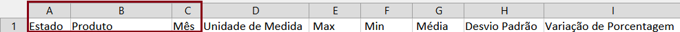
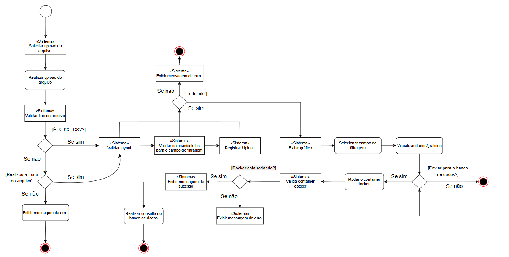

<h1 align="center" style="font-weight: bold;">Genesights 📊</h1>

<div align="center">
    
    
    
    
    
</div>

## 🔧 Pré-requisitos

- [Python](https://www.python.org/downloads/)
- Importação de todas bibliotecas, o mesmo pode ser instalalado via terminal atráves do comando.

```yaml
pip install streamlit
pip install pandas
pip install matplotlib
pip install sqlalchemy
pip install dotenv
```

## ⚙️ Particularidades do sistema

 - Para a correta geração do gráfico no sistema e a prevenção de erros, o arquivo <code>(.xlsx, .csv)</code> deve seguir o layout padrão pré-definido, em conformidade com a simplicidade da ferramenta. Para gerar todos os valores na ferramenta Genesights, é necessário seguir todo layout conforme consta na imagem abaixo:
  


- O usuário precisa ter no minímo algumas colunas obrigatórias para geração de gráficos dentro da ferramenta, conforme consta na imagem abaixo (Elementos obrigatórios para realizar a filtragem dos meses).
  
 

- A coluna <code>Max, Min, Média, Desvio Padrão, Variação de Porcentagem</code> serão utilizado para geração de gráfico com base na sua necessidada, ou seja, caso queira um gráfico de valores máximo o arquivo (.xlsx, .csv) necessita ter o coluna <code>MAX</code> com alguns valores.
  
  - <strong> OBS: Não é necessário seguir a mesma ordem do layout. </strong>

## 📕Tabela de conteúdos

- [🔧 Pré-requisitos](#-pré-requisitos)
- [⚙️ Particularidades do sistema](#️-particularidades-do-sistema)
- [📕Tabela de conteúdos](#tabela-de-conteúdos)
  - [Sobre o projeto:](#sobre-o-projeto)
  - [Diagrama de atividade:](#diagrama-de-atividade)
  - [Docker-compose.yml:](#docker-composeyml)

### Sobre o projeto:

O Genesights é uma ferramenta voltada para a geração simplificada de gráficos. Muitas pessoas trabalham diariamente com análises em arquivos (.xlsx, .csv) que contêm dados com grande potencial de insights. Planilhas são parte da rotina de diversas áreas acadêmicas e profissionais.

Com o Genesights, buscamos reduzir a necessidade de fórmulas complexas, do uso exclusivo de ferramentas avançadas como Power BI ou de conhecimento técnico aprofundado para criar gráficos. A solução permite que qualquer usuário, seguindo um layout básico, gere visualizações rápidas e intuitivas, sem precisar dominar manipulações avançadas de planilhas.

### Diagrama de atividade:

Descrição do fluxo dessa ferramenta. Após análisar o fluxo, o usuário pode ter uma melhor visualização do funcionamento da ferramenta Genesights.



### Docker-compose.yml:

Criação do container Docker, a conexão via banco de dados tem o gerenciamento de credenciais com base no arquivo <code>docker-compose.yml</code>

```yaml
services:
  postgres_db:
    image: postgres:13.20
    container_name: "postgresdb"
    environment:
      POSTGRES_DB: "GENESIGHTS_DATABASE"
      POSTGRES_USER: "postgres"
      POSTGRES_PASSWORD: "admin"
    ports:
      - "5432:5432"
    networks:
      - genesights-network

  pgadmin4:
    image: dpage/pgadmin4
    container_name: "pgadmin4"
    environment:
      PGADMIN_DEFAULT_EMAIL: "admin@admin.com"
      PGADMIN_DEFAULT_PASSWORD: "admin"
    ports:
      - "15432:80"
    depends_on:
      - postgres_db
    networks:
      - genesights-network

networks:
  genesights-network:
    driver: bridge
```